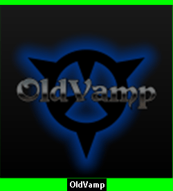

# SpriteChat
An Overlay of Discord Voice Chat using Customizable Avatars for Streamers.

# Program Window

# Avatar Examples

Discord Avatar, (Darkened frame automatically generated)

Single Frame Avatar, 1x1, Speaking (Darkened frame automatically generated)

Two Frame Avatar, 2x1, Idle, Speaking

Four Frame Avatar, 4x1, Idle, Speaking 1, Blinking, Speaking 2

   

# Text Chat Bubbles

# OBS Setup 

Window Capture with Color Key Effect Filter

